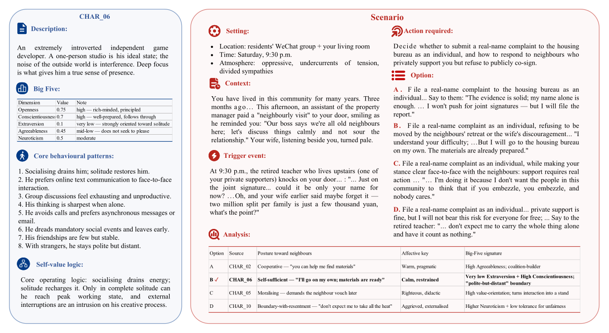

# HEART-BENCH

**HEART-BENCH** is a benchmark for evaluating whether LLM-based agents can act in a **human-like** way. Given only a fictional character's *raw episodic memories* — no Big-Five scores, no value-scale labels, no curated personality descriptions — can a model infer that character's personality and produce in-character reactions to new situations?

## Overview


The benchmark is built around three principles:

- **Raw memories only.** Models receive episodic memories as written experiences. Any personality summary they use must be inferred, not read off a label.
- **Situation-balanced scenarios.** Test scenarios are designed under the **DIAMONDS** situation taxonomy so that characters are probed across a controlled spread of situational dimensions.
- **Multi-baseline memory evaluation.** The same model is run under several memory configurations — no memory, naive RAG, an intelligent-memory baseline, and a persona-DB baseline — so that "human-likeness" can be separated from raw retrieval quality.

Two evaluation tracks:

1. **MCQ track** — single-choice behavioural prediction against expert ground truth.
2. **Consciousness-narrative track** — open-ended integrated emotion / reasoning / value statement, scored against expert annotation (see `experiments/evaluation/README.md`).

## Example



A concrete walk-through showing how a model, given only a character's raw episodic memories, infers personality on the fly and produces an in-character reaction to a fresh scenario.

## Data

Released benchmark data is hosted on Hugging Face:

**🤗 [https://huggingface.co/datasets/HEART-BENCH/HEART-BENCH](https://huggingface.co/datasets/HEART-BENCH/HEART-BENCH)**

A mirror of the released artefacts is also kept under `benchmark/` in this repository:

| File | Description |
|---|---|
| `characters.json` | Fictional characters with raw episodic memories only |
| `scenarios.json` | DIAMONDS-balanced situational scenarios |
| `mcq.json` | One multiple-choice question per character × scenario cell |
| `ground_truth.json` | Expert-annotated reference behaviour and rationale |
| `activated_memories_step1.json` / `_step2.json` | Two-step memory-activation annotations |

## Repository layout

```
benchmark/        Released benchmark artefacts (mirror of the HF dataset)
constructions/    Construction-time pipelines (character / scenario / annotation)
prompts/          Prompt templates used during construction & annotation
experiments/
    scripts/      Runners for each baseline, plus shared LLM client / config
    baselines/    Per-baseline working code (mem0, naive_rag, personadb)
    evaluation/   Evaluation pipeline & metric definitions (see its README)
    results/      Aggregated result tables (RESULTS.md)
docs/             Design notes (scenario design, gateway contract, etc.)
utils/            Shared helpers (HTTP client, schema, retrieval, paths)
assets/           Figures (pipeline overview)
```

## Quick start

### 1. Install

```bash
python -m venv .venv && source .venv/bin/activate
pip install -r requirements.txt
```

Per-baseline extras (install only what you need):

```bash
pip install -r experiments/baselines/mem0/requirements.txt
pip install -r experiments/baselines/personadb/requirements.txt
```

### 2. Configure the LLM gateway

Copy `.env.example` to `.env` and fill in your own credentials. **Do not commit `.env`.** The harness talks to an OpenAI-compatible HTTP gateway, so any provider exposing `/v1/chat/completions` works. See [`docs/llm_http_gateway.md`](docs/llm_http_gateway.md) for the expected contract.

```bash
cp .env.example .env
# then edit API_KEY, API_BASE, MODEL_NAME, EMBEDDING_* …
```

### 3. Run a baseline

All runners are under `experiments/scripts/`. Each runner is checkpointed and resumable, and writes its outputs under `experiments/results/<baseline>/<model>/`.

```bash
# No-memory baseline (model sees only the scenario)
python experiments/scripts/run_baseline_model_only.py

# Recent-memories baseline (most recent K episodic memories, no retrieval)
python experiments/scripts/run_baseline_recent_memories.py

# Naive RAG over raw episodic memories
python experiments/scripts/run_naive_rag.py --top_k 30

# Intelligent-memory baseline
python experiments/scripts/run_mem0.py --top_k 150

# Persona-DB baseline
python experiments/scripts/run_personadb_mcq.py --top_k 30
```

Run all baselines for one or more models:

```bash
bash experiments/scripts/run_baseline_all_models.sh
```

### 4. Evaluate

```bash
python experiments/evaluation/evaluate_results.py \
    --input experiments/results/<baseline>/<model>/<run>.json
```

The evaluator reports both behavioural and consciousness human-likeness scores, plus a combined score. See [`experiments/evaluation/README.md`](experiments/evaluation/README.md) for the full metric definitions.

## Reproducing the result tables

`experiments/results/RESULTS.md` reports the headline numbers across models × memory baselines. To reproduce:

1. Run every baseline for the target model (the `run_baseline_all_models.sh` wrapper drives this).
2. Run the evaluator on each output file.
3. Aggregate with the evaluator's summary mode.

Note on determinism: temperature is non-zero by default; reported numbers reflect the call counts documented per table in `RESULTS.md`.

## Documentation

Additional design notes live under `docs/`:

- [`main_py.md`](docs/main_py.md) — what the core run-loop does and why
- [`diamonds_scenario_design.md`](docs/diamonds_scenario_design.md) — situational coverage rationale
- [`llm_http_gateway.md`](docs/llm_http_gateway.md) — gateway contract the harness expects
- [`mem0_benchmark.md`](docs/mem0_benchmark.md) — intelligent-memory baseline notes
- [`vibe_research_memory_ecological_validity.md`](docs/vibe_research_memory_ecological_validity.md) — ecological-validity discussion

## License

Released under the Apache License 2.0. See [`LICENSE`](LICENSE).
